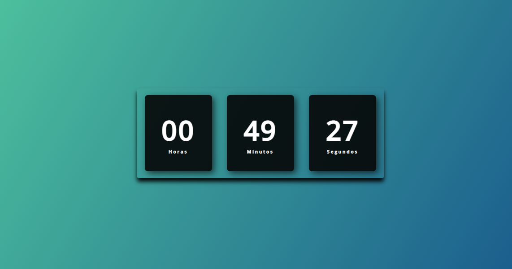

# Digital_Clock

- Esse projeto é um relógio digital, estilizado.

- O arquivo de execussão é o `index.html`.

- O output é a página `Digital Clock`, aberta pelo browser.

## Preview

- Print do output da página no browser como exemplo:

</body>
</html>

<!DOCTYPE html>
<html lang="en">
<head>
    <meta charset="UTF-8">
    <meta http-equiv="X-UA-Compatible" content="IE=edge">
    <meta name="viewport" content="width=device-width, initial-scale=1.0">
    <title>Document</title>
</head>
<body>
    

        </img>
    

</body>
</html>
